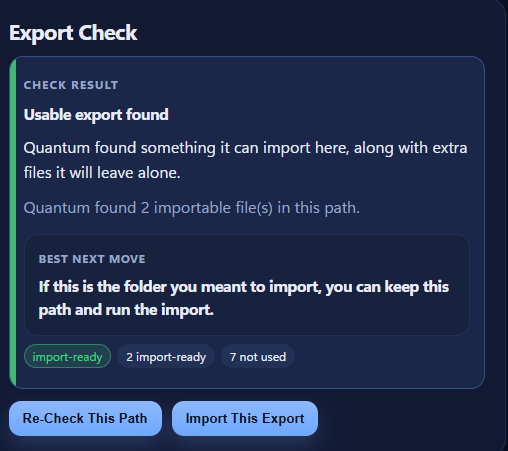
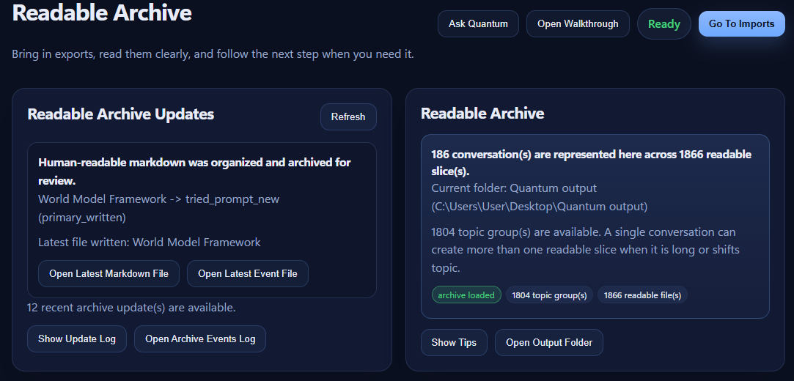
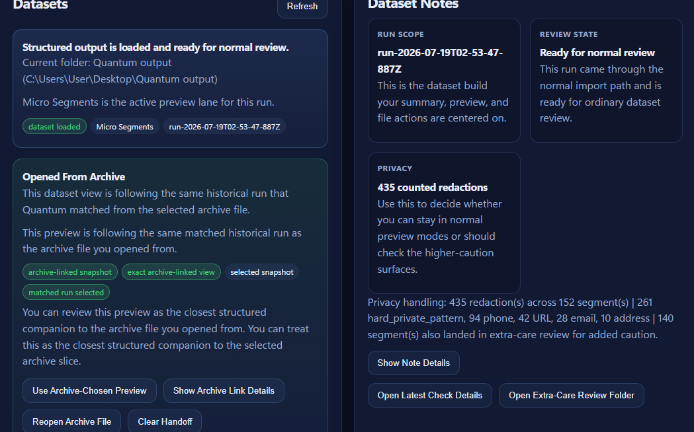
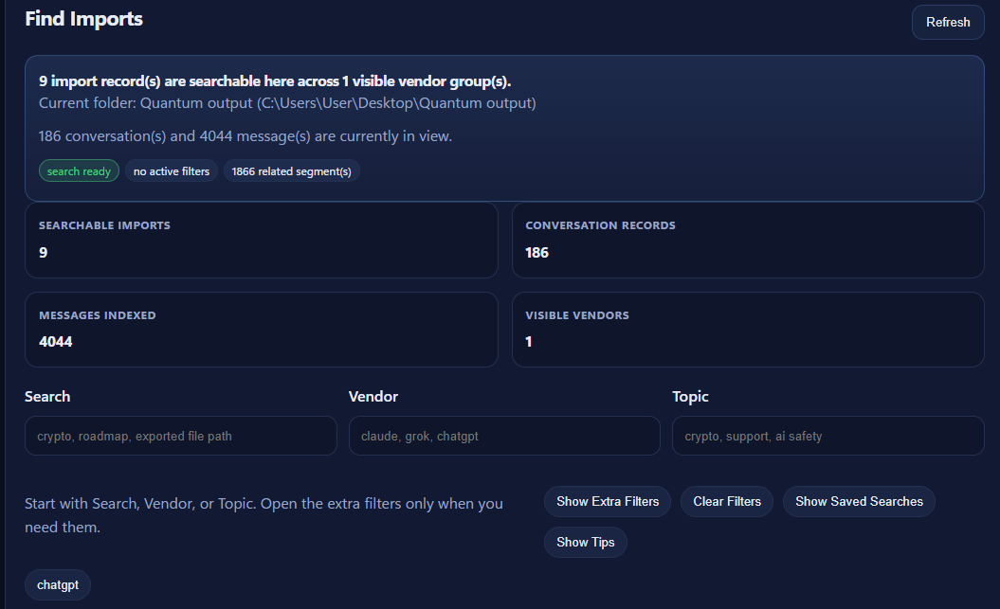
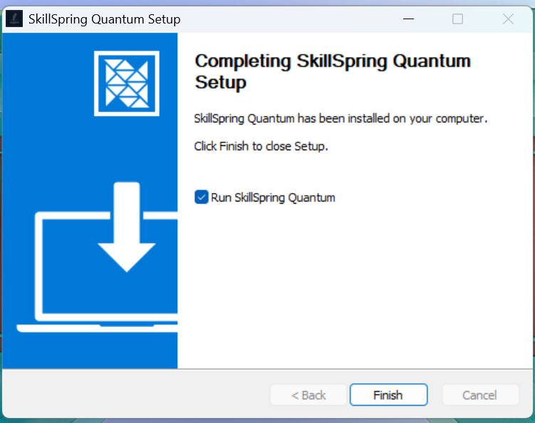

# SkillSpring Quantum

Quantum is a local-first Windows desktop app for turning AI conversation exports into readable archives, searchable history, and privacy-aware datasets.

It is built for people who want to keep AI history on their own machine, revisit conversations later, and work across more than one assistant without uploading those exports to another service.

## Current Status

**OpenAI Build Week submission published; private beta preparation continues.** The core Windows workflow and `0.1.0-beta.1` installer have been validated on a separate clean laptop. The next stage is controlled external testing focused on usability, recovery, and real-world search quality.

Watch the [three-minute Build Week demo](https://www.youtube.com/watch?v=pldsPIb_Evo) or view the [Devpost submission](https://devpost.com/software/skillspring-quantum).

`Ask Quantum` is still experimental and should not yet be treated as the primary or fully reliable workflow path.

## Why Quantum

- Search conversations you remember asking
- Keep AI history local
- Browse readable archives instead of raw export files
- Find conversations across supported AI assistants
- Build structured datasets when needed

## Core Workflow

Export AI conversations, then use Quantum's main beta path:

`Imports -> Readable Archive -> Datasets -> Find Imports`

`Activity History` sits after that path as a verification and recovery screen.

## See the Workflow

| Check an export before processing | Review a readable local archive |
| --- | --- |
|  |  |

| Inspect structured output | Find imported conversations again |
| --- | --- |
|  |  |

## Supported Exports

Current supported vendors for the private beta path:

- ChatGPT / OpenAI
- Claude
- Gemini
- Grok
- Microsoft Copilot activity CSV for the validated export shape

Compatibility fallback:

- Gemini My Activity HTML

## Platform

- Windows

## Screens

The current product includes dedicated views for:

- Dashboard
- Imports
- Readable Archive
- Datasets
- Find Imports
- Activity History

The main beta path is still:

`Imports -> Readable Archive -> Datasets -> Find Imports`

`Ask Quantum`, Diagnostics, Governance, and the other extra tools are follow-up tools rather than the primary evaluator path today.

## Built with Codex and GPT-5.6

Quantum was developed with Codex and GPT-5.6 as active engineering collaborators. They were used to inspect and refactor the TypeScript and Electron codebase, plan and implement import-recovery safeguards, add regression tests, diagnose packaged-runtime problems, and shape the product and evaluator documentation.

The product keeps deterministic code authoritative for import detection, preservation, archives, datasets, and search indexes. The optional local assistant remains secondary to that deterministic workflow.

## Installation

### Users

Quantum is currently distributed as a controlled Windows private-beta build.

> [**Download SkillSpring Quantum for Windows (0.1.0-beta.1)**](https://github.com/SkillSpringAI/SkillSpring-Quantum/releases/download/v0.1.0-beta.1/SkillSpring-Quantum-0.1.0-beta.1-Setup.exe)
>
> This is an unsigned private-beta installer. Windows SmartScreen may require **More info** then **Run anyway** when you install this trusted build.

Current user flow:

1. Download the Windows installer
2. Install Quantum
3. Launch the app
4. Import a supported AI export

The current `0.1.0-beta.1` Windows installer completes as a standard local installation:



The [GitHub prerelease page](https://github.com/SkillSpringAI/SkillSpring-Quantum/releases/tag/v0.1.0-beta.1) also includes the installer checksum and supporting update metadata.

Build Week evaluators can also use the included synthetic [demo export](examples/build-week-demo/README.md) without sharing personal conversation data.

See the [Beta Guide](docs/user/BETA_GUIDE.md) and [User Guide](docs/user/USER_GUIDE.md) for the current workflow and expectations.

### Evaluate from source

To run the evaluator path without a personal export, install the development dependencies and launch the desktop app:

```bash
npm install
npm run electron:dev
```

Then open `Imports`, select [`examples/build-week-demo/chatgpt-conversations.json`](examples/build-week-demo/chatgpt-conversations.json), run `Export Check`, and import it. In `Find Imports`, start with one of Quantum's suggested topics, then refine from the visible imported results if needed.

For a Windows installer built from the checked-out source, run `npm run package:win`. Full setup and verification commands are in the [Development Guide](docs/technical/DEVELOPMENT_GUIDE.md).

### Developers

Development setup, scripts, packaging, and test commands live in the [Development Guide](docs/technical/DEVELOPMENT_GUIDE.md).

## Documentation

- [User Guide](docs/user/USER_GUIDE.md)
- [Export Guides](docs/user/exports/README.md)
- [FAQ](docs/user/FAQ.md)
- [Known Limitations](docs/user/KNOWN_LIMITATIONS.md)
- [Beta Guide](docs/user/BETA_GUIDE.md)
- [MVP Roadmap](docs/project/MVP_ROADMAP.md)
- [Build Week Submission](docs/project/BUILD_WEEK_SUBMISSION.md)
- [Project History](docs/project/PROJECT_HISTORY.md)
- [Architecture](docs/technical/ARCHITECTURE.md)
- [Development Guide](docs/technical/DEVELOPMENT_GUIDE.md)
- [Technical Reference](docs/reference/TECHNICAL_REFERENCE.md)
- [Contributing](CONTRIBUTING.md)

## For Contributors

If you are evaluating the codebase rather than the product, start with:

- [docs/README.md](docs/README.md)
- [Architecture](docs/technical/ARCHITECTURE.md)
- [Development Guide](docs/technical/DEVELOPMENT_GUIDE.md)
- [Testing](docs/technical/TESTING.md)
